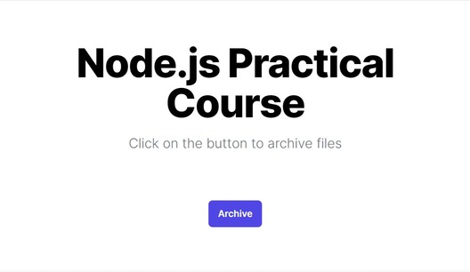

# Task: **child_process** module
This is a [Next.js](https://nextjs.org/) project bootstrapped with [`create-next-app`](https://github.com/vercel/next.js/tree/canary/packages/create-next-app):

## Implement the functionality to archive files when a button is clicked on the `Archive` button

Write code that creates an API endpoint for archiving files. The API endpoint should respond to to the `POST` request ([Next.js Route Handlers Documentation](https://nextjs.org/docs/app/building-your-application/routing/route-handlers)) and execute a command to zip and archive files located in the `./data` directory. The archive file should be named 'archive_YYYY-MM-DD_HH-MM-SS.zip', where 'YYYY-MM-DD_HH-MM-SS' represents the current date and time. The archived files should be stored in the `./archives` directory.

Integrate this API endpoint with the UI - when the button is clicked, it should trigger a request to the API endpoint to initiate the archiving process.
